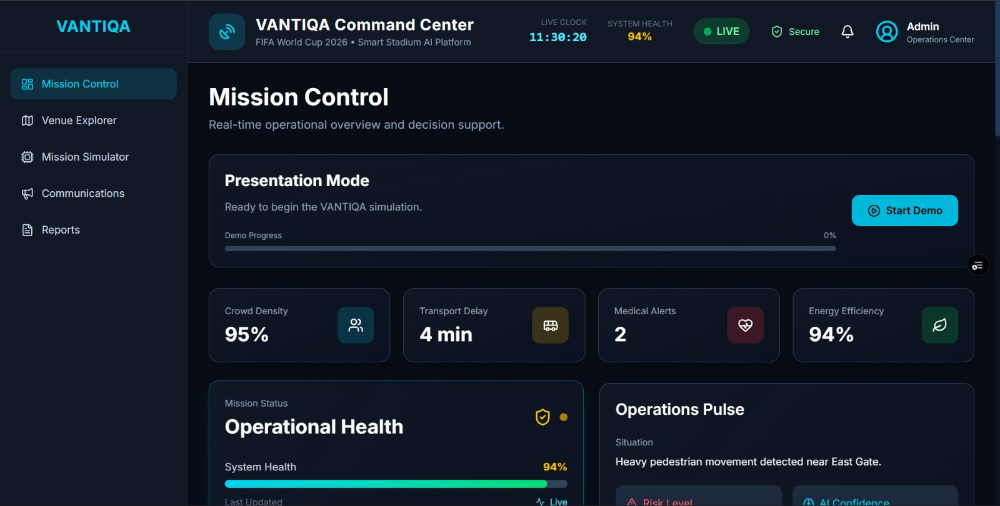
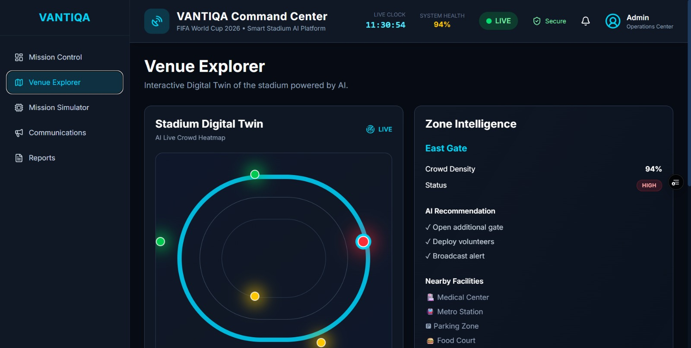
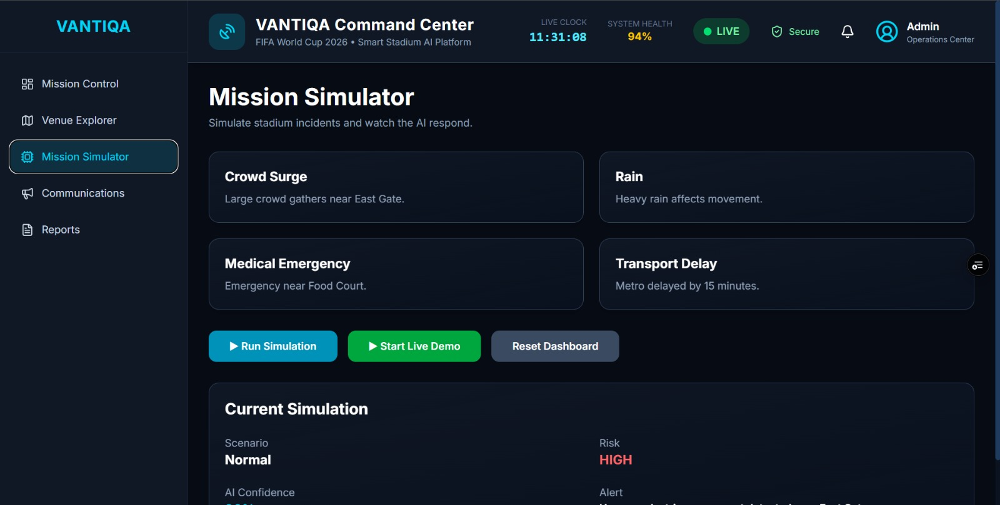
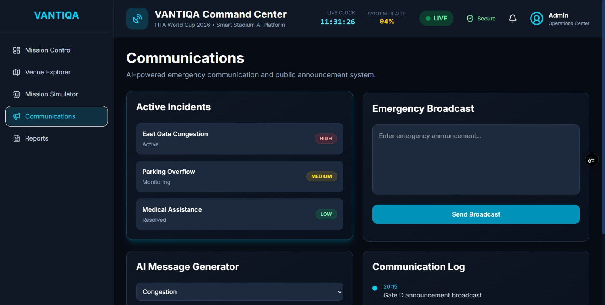
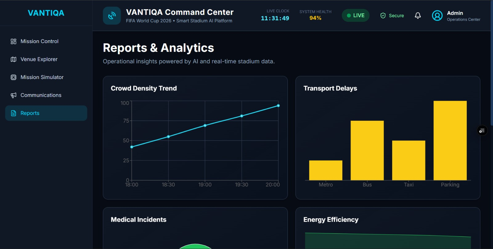

# 🏟️ VANTIQA
### AI-Powered Smart Stadium Command Center for FIFA World Cup 2026

VANTIQA is an intelligent command center designed to assist stadium operators during large-scale sporting events such as the FIFA World Cup 2026. The platform combines AI-assisted decision support, real-time monitoring, crowd analytics, digital twin visualization, and emergency communication into a single operational dashboard.

---

## 🚀 Features

- 📊 Real-time Mission Control Dashboard
- 🧠 AI Decision Support System
- 🏟️ Interactive Stadium Digital Twin
- 👥 Crowd Density Monitoring
- 🚨 Emergency Incident Detection
- 📢 Multi-channel Communication Center
- 📈 Analytics & Reports Dashboard
- 🎬 AI Simulation Mode
- ⚡ Live KPI Monitoring
- 🔔 Real-time Timeline & Alerts

---

# 📸 Screenshots

## Mission Control



---

## Venue Explorer



---

## Mission Simulator



---

## Communications



---

## Reports Dashboard



---

# 🛠️ Tech Stack

### Frontend

- React
- Vite
- Tailwind CSS
- React Router

### UI

- Lucide Icons
- Framer Motion
- React Hot Toast

### Visualization

- Recharts

### Development

- JavaScript (ES6+)
- Context API

---

# 📂 Project Structure

```
src
│
├── components
│   ├── dashboard
│   ├── communications
│   ├── reports
│   ├── venue
│   ├── layout
│   └── ui
│
├── context
│
├── pages
│
└── assets
```

---

# ⚙️ Installation

Clone the repository

```bash
git clone https://github.com/AthulPBiju/vantiqa-smart-stadium.git
```

Go into the project

```bash
cd vantiqa-smart-stadium
```

Install dependencies

```bash
npm install
```

Start the development server

```bash
npm run dev
```

Build for production

```bash
npm run build
```

---

# 🎯 Use Cases

- FIFA World Cup Operations
- Smart Stadium Management
- Crowd Flow Optimization
- Emergency Response Coordination
- AI-assisted Operational Decision Making
- Public Safety Monitoring

---

# 🌟 Key Highlights

- AI-driven operational recommendations
- Digital Twin visualization
- Live mission timeline
- Intelligent crowd analytics
- Automated emergency workflows
- Interactive dashboards
- Responsive modern UI
- Simulation mode for demonstrations

---

# 📈 Future Enhancements

- Computer Vision Crowd Detection
- Drone Surveillance Integration
- IoT Sensor Connectivity
- Predictive Crowd Analytics
- Multi-language Emergency Broadcasts
- Mobile Command Center
- Edge AI Deployment
- Weather-aware Risk Prediction

---

# 👨‍💻 Developer

**Athul P Biju**

B.Tech Computer Science & Engineering

Model Engineering College, Kochi

GitHub:
https://github.com/AthulPBiju

---

## ⭐ If you like this project, consider giving it a star!